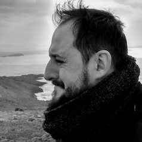

Hi, I'm Lorenzo! 

- Italian national, born and raised in Madrid, Spain, currently living in Warsaw, Poland.   
- Graduated in Psychology, Master degree in Ethology and Human Behaviour and Master degree in Research Methods for the Behavioural Sciences (Universidad Complutense de Madrid, Universidad Nacional de Educación a Distancia). 
- Taught statistics and research methods for health sciences at Universidad Alfonso X el Sabio.   
- Moved to Poland to work in consultancy, switched to work as a Data Science expert in pharma. 

